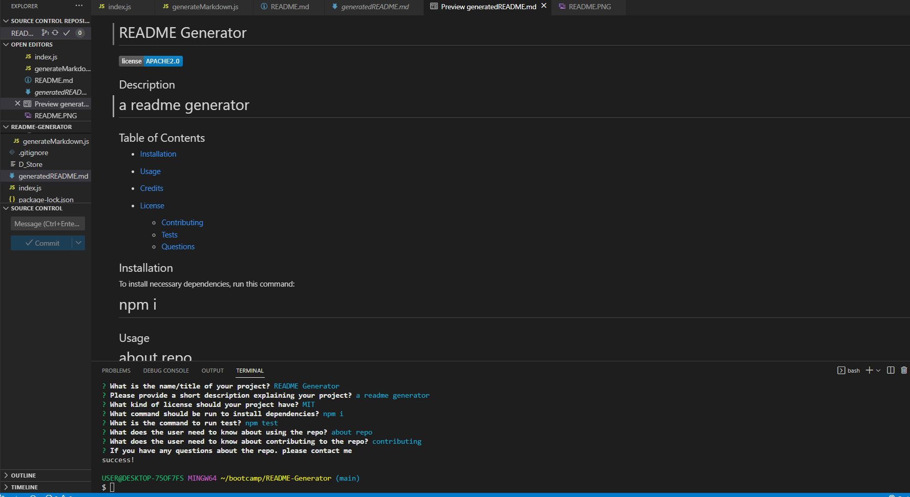

# Professional README Generator

## Description

This professional README was dynamically generated from a command-line application. We can effortlessly create a README file by deploying a command-line application to generate a README for a new project.

The application will be invoked by deploying this command (node index.js). When a user is prompted for information about the application repository, an excellent, five-star, professional README is generated.

The professional README generated will have the following: 

1. The title of my project
2. Sections entitled:
1. Description
2.   Table of Contents
3.   Installation
4. Usage
5. License
6. Contributing
7. Tests
8. Questions

## Usage

When a user enters the project title, the README will display it as the title of the README. When a user enters a description, installation instructions, usage informations, contributing guidelines and test instructions, this information is added to the sections of the README.

When a user chooses a license for their application from the dropdown list of options, a badge for that license is added near to the top of the READMEand a notice is added to lisence section of the README.

When a user enters their GitHub username, it's added to the section of README labeled Questions, with a link to their GitHub profile. In the same process when a user enters their email address, it will be added to the Questions section with instructions to get in contact.

When a user enters the link in the Table of Contents, they will be taken to the corresponding section of the README.

## Installation

The user need to install the dependencies to the application by using the command-line npm i (node package manager), and also run the test by using npm test.

## Lisence

Please refer to the lisence in the repo.